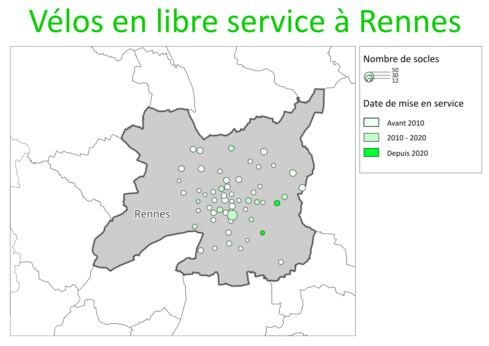

# Mobilités douces à Rennes

Projet sur les mobilités douces à Rennes.
*Dans un premier temps, visualisation cartographique des stations vélos de la STAR à Rennes Métropole. Cette représentation est à compléter / associer avec les transports en commun et les parkings vélo fermés a minima.*

Données représentées :
- Localisations des stations vélos sur la métropole
- Capacités / nombre de socle par station vélo.
- Ancienneté des stations vélos

## Outils utilisés

- QGIS
- inkscape

## Méthodologie

- filtrage des stations ouvertes
- représentations proportionnelles selon le nombre de socles
- colorisation des stations selon leur date de mise en service
- export SVG depuis QGIS
- finalisation graphique sous Inkscape
- export PNG depuis inkscape

## Fichiers

* 'exports/mobilites35.svg' - Version vectorielle du projet, modifiable sous inkscape
* 'exports/mobilites35.png' - Version image du projet pour une meilleure visualisation sur GitHub
* 'mobilites35.qgz' - Projet QGIS sur les transports en commun à Rennes

> Les couches sources (fichiers `.shp` ne sont pas versionnées en raison de leurs tailles.
> Voir les sources ci-dessous pour les télécharger.

## Sources des données

Toutes les données ont été récupérées sur la plateforme de données de Rennes métropole :
(https://data.rennesmetropole.fr)
* Limites communales de Rennes Métropole
* Vélos en libre-srevice du STAR
